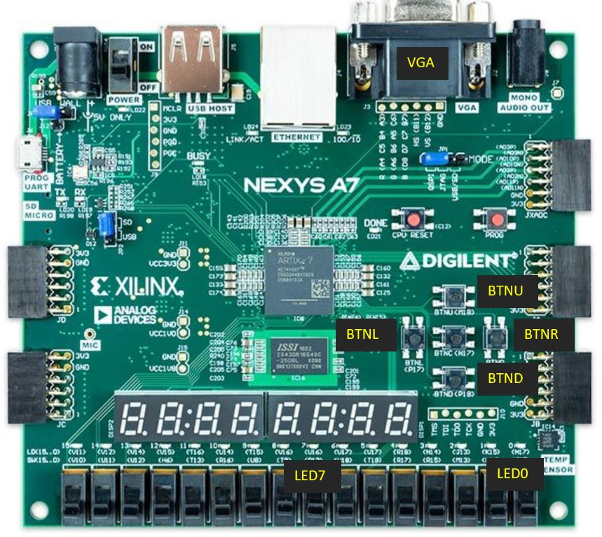

# nnISA nnSOC nnCPU nnAs nnCc

# This project contains
1. Design of a very simple ISA
2. SOC + CPU named nnRv, nn is my daughter's name niannian, this whole project is as 'simple' as my little daughter.
3. Assembler, so you can write assembly codes, build and run it in simulations.
4. Limited compiler, so you can write a bit more complicated programs.

This project is not used to solve any problems, but just a hobby for me which makes me understand the basic concept of ISA, CPU, assembler, compiler etc.

# About this ISA

```
r0 - r31 32 general registers
r0  - zero
r29 - bp
r30 - sp
r31 - pc

1) instr type:

I-Type:
|--Op(8 bits)---|---Rd(5 bits)---|---NU(3 bits)---|---uImm(16 bits)---|
R-Type:
|--Op(8 bits)---|---Rd(5 bits)---|---Rs1(5 bits)---|---Rs2(5 bits)---|---sImm(9 bits)---|

OP = MOP(3 bits) + SOP(5 bits)

2) instr code:

2.1) get uImm

MOP = 0x0

Rd[31:16]  = uImm
Rd[15:0]   = uImm

luil rd, uImm_16bit
SOP = 0x0
luih rd, uImm_16bit
SOP = 0x1

2.2) Logical

MOP = 0x1

Rd = Rs1 oper Rs2
	oper : add, sub, lls, lrs, ars, and, or,  xor
	SOP  : 0x0, 0x1, 0x2, 0x3, 0x4, 0x5, 0x6, 0x7

xxx rd, rs1, rs2, sImm
->
rd = rs1 xxx (rs2 + sImm)

2.3) Load and Store

MOP = 0x2

Rd = mem[Rs1 + (Rs2 + sImm)]
SOP = 0x0
mem[Rs1 + (Rs2 + sImm)] = Rd
SOP = 0x1

ldr rd, rs1, rs2, sImm
str rd, rs1, rs2, sImm

2.4) jump

MOP = 0x3

Jumpxxx Rd, Rs1, Rs2
xxx means (eq, ne, lt, ge)
SOP =      0   1   2   3

jne rd, rs1, rs2, sImm
->
if (rs1 xxx rs2)
    pc = rd + sImm

```

# About the SOC Periperals

```
0x80000000 gpio in  KEY[1:0] 2-DOWN 1-UP 0-LEFT 1-RIGHT
0x80000004 gpio out LED[7:0]
0x80001000 VGA red square x   [31:16] left-x [15:0] right-x
0x80001004 VGA red square y   [31:16] up-y [15:0] down-y
0x80001008 VGA green square x [31:16] left-x [15:0] right-x
0x8000100c VGA green square y [31:16] up-y [15:0] down-y
```

# Compiler and Assembler

```
Compiler is mostly from http://pandolia.net/tinyc.
This compiler is a limited one, so only supports parts of C language, please see the URL shown above for more details.
Feature of pointer read and write are added.
So, before you compile the project, please install bison and flex.

Macro file and assembler is written in Python.
Macro file is used to translate intermedia codes into nnISA assembly codes.
Assembler is used to translate the assembly codes into nnISA machine codes.
```

# How to play it
## Play it on Nexys-A7 board



```
If you have a nexys-a7 board, you can open the project file and program it into the board.
There are two branches:
on nexys-a7 branch, you can use 'make nexys-a7' to compile the codes.
nexys-a7 uses BTNR and BTNL as input, LED0-7 as output, if you press
BTNR, the lighted LED should shift to left side, if you press BTNL, the lighted LED should
shift to right. Notes: if you press BTNL when the LED[0] is lighted, all of the LED will be
off and never be lighted again, because the 1 bit is shifted out of the register.
```


```
on nexys-a7-vga branch, you can use 'make nexys-a7-vga' to compile the codes.
nexys-a7-vga uses BTNR, BTNL, BTNU, BTND to control a red square which will show on VGA screen.
```


```
on sim-isa-0p2 branch, you can both
$ make sim
It will build project, and then open wave file by using gtkwave.
$ make nexys-a7
It will build project, when it is done successfully, you can open a vivado project, add nexys-a7.v,
nnRv.v to the project, build it, then load it to FPGA.
You will see LED is flashing, and its behavior is controlled by the BTNR and BTNL button.
$ make nexys-a7-vga
It will build project, when it is done successfully, you can open a vivado project, add nexys-a7-vga.v,
nnRv.v, vgaTop.v, vga800x600.v to the project, build it, then load it to FPGA.
A game will be shown on the VGA screen, use BTNR, BTNL to controll the green pad to catch the red ball.

```


## Play it on iVerilog

```
If you don't have a board, you can checkout sim branch, and use 'make sim' to run a simple code
in iverilog simulation tool.
```

# About Codes

```
Note: Some files are different on different branches, so make sure you are on right branch.

Makefile			# Makefile
Nexys-A7-100T-Master.xdc	# Constraints file
sim.v				# Simulation top file
nexys-a7.v			# nexys-a7 top file
nexys-a7-vga.v			# nexys-a7-vga top file
nnasm.py			# Assembler
nnas.s				# Test assembly code
nnRv_org.v			# CPU verilog code
nnRv.v				# It is produced by ram_init_proc.py
pic				# Introduction pictures
ram_init_proc.py		# Copy the assembly binary into CPU
ram.mem				# Assembly binary
README.md			# readme
vga800x600.v			# VGA module from https://github.com/WillGreen/timetoexplore.git
vgaTop.v			# VGA module from https://github.com/WillGreen/timetoexplore.git
vivado_prj			# Built vivado project.
parser.y scanner.l		# Bison and Flex configure file, see http://pandolia.net/tinyc for more detail
nnmacro.py			# Map the intermedia code compiled by compiler into nnISA.
```

